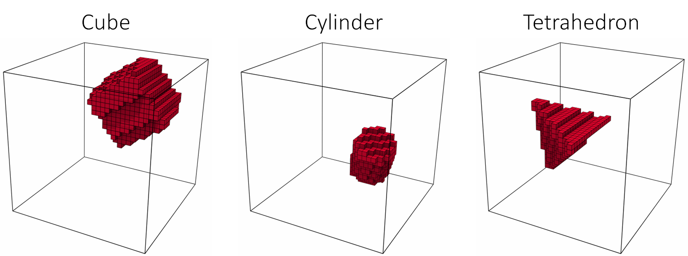
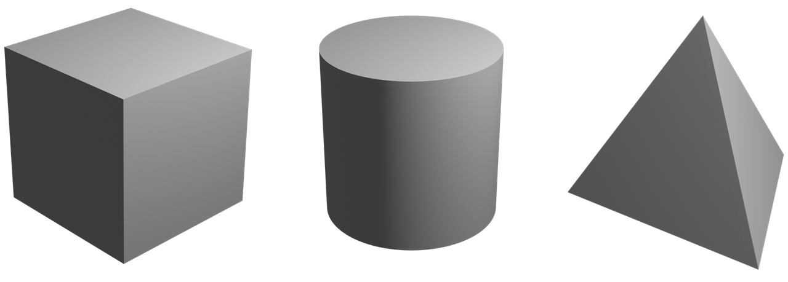
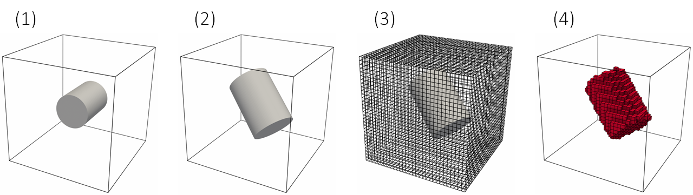

# Basic Shape Classification Using 3D CNNs

INTRO HERE

This repository provides a short tutorial on basic shape classification using three-dimensional (3D) convolutional neural networks (CNNs). All data for training and testing the model in this example has been provided.

## Methodology

### Data Generation and Augmentation

The goal of the proposed model is to classify 3D image data according to the primitive shapes they represent.

Three basic shapes are considered for classification and they include the *cube*, *cylinder* and *regular tetrahedron*. These shapes were generated with Blender in the form of triangle surface mesh (.stl) and can be seen in the figure above.

### Model

### Training

## Results and Analysis
