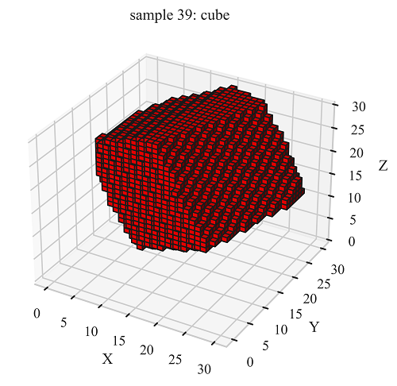

# Basic Shape Classification Using 3D CNNs


INTRO HERE

This repository provides a short tutorial on basic shape classification using three-dimensional (3D) convolutional neural networks (CNNs). All data for training and testing the model in this example has been provided.

## Methodology

### Data Generation and Augmentation


The goal of the proposed model is to classify 3D image data according to the primitive shapes they represent. Three basic shapes are considered for classification and they include the *cube*, *cylinder* and *regular tetrahedron*. These shapes were generated with Blender in the form of triangle surface mesh (.stl) and can be seen in the figure above.

For each of the three shapes, and for a pre-determined number of samples desired for each shape, the process of generating a sample image is as follows:

1. Place the Blender generated primitive shape at the center of a bounding box.
2. Sequentially apply a random 3D rotation, scale, and displacement to the shape. (Augmentation)
3. Define a voxel-grid encompassing both the permutated shape and bounding box.
4. Segment the voxels according to their location with respect to the permutated shape. Voxels whose centroids are located within the permutated shape are given a label of "1", if not a label of "0" is assigned.


As can be seen from the figure above illustrating the data generation workflow, Step 2 represents a series of data augmentation procedures; without it, there would only be 1 possible sample per image. For this example, 1000 samples of data are generated for each shape.

```python
import numpy as np
import matplotlib.pyplot as plt
import seaborn as sns


# Load data and labels
data = np.load('data.npy')
labels = np.load('labels.npy')

class_names = ['cube', 'cylinder', 'tetrahedron']

# Plotting a random sample
sns.set_theme(style="whitegrid", font_scale=1, font='Times New Roman')
idx = np.random.randint(len(data))
voxels = np.squeeze(data[idx])
ax = plt.figure().add_subplot(projection='3d')
ax.voxels(voxels, facecolors='red', edgecolor='k')
ax.set_xlabel('X')
ax.set_ylabel('Y')
ax.set_zlabel('Z')
ax.set_title('sample ' + str(idx) + ': ' + class_names[labels[idx]])
plt.show()
```
<p align="center">
    
</p>

### Model

The model architecture chosen for this example is arbitrary and has undergone no hyperparameter optimization.

```python
from tensorflow.keras.models import Sequential
from tensorflow.keras.layers import Conv3D, MaxPooling3D, BatchNormalization, Dropout, Flatten, Dense


#  Create the model
model = Sequential()
model.add(Conv3D(16, (3, 3, 3), activation='relu', input_shape=(30, 30, 30, 1)))
model.add(MaxPooling3D((2, 2, 2)))
model.add(Conv3D(32, (3, 3, 3), activation='relu'))
model.add(MaxPooling3D((2, 2, 2)))
model.add(Conv3D(64, (3, 3, 3), activation='relu'))
model.add(MaxPooling3D((2, 2, 2)))
model.add(Flatten())
model.add(Dense(64, activation='relu'))
model.add(Dropout(0.2))
model.add(Dense(3))

model.summary()
```
```
Model: "sequential"
_________________________________________________________________
Layer (type)                 Output Shape              Param #   
=================================================================
conv3d (Conv3D)              (None, 28, 28, 28, 8)     224       
_________________________________________________________________
max_pooling3d (MaxPooling3D) (None, 14, 14, 14, 8)     0         
_________________________________________________________________
conv3d_1 (Conv3D)            (None, 12, 12, 12, 16)    3472      
_________________________________________________________________
max_pooling3d_1 (MaxPooling3 (None, 6, 6, 6, 16)       0         
_________________________________________________________________
conv3d_2 (Conv3D)            (None, 4, 4, 4, 32)       13856     
_________________________________________________________________
max_pooling3d_2 (MaxPooling3 (None, 2, 2, 2, 32)       0         
_________________________________________________________________
flatten (Flatten)            (None, 256)               0         
_________________________________________________________________
dense (Dense)                (None, 32)                8224      
_________________________________________________________________
dropout (Dropout)            (None, 32)                0         
_________________________________________________________________
dense_1 (Dense)              (None, 3)                 99        
=================================================================
Total params: 25,875
Trainable params: 25,875
Non-trainable params: 0
_________________________________________________________________
```

### Training

```python
from tensorflow.keras.losses import SparseCategoricalCrossentropy
from sklearn.model_selection import train_test_split


# Compile the model
model.compile(optimizer='adam',
              loss=SparseCategoricalCrossentropy(from_logits=True),
              metrics=['accuracy'])

history = model.fit(X_train, y_train, epochs=20,
                    batch_size=64,
                    validation_data=(X_test, y_test))

test_loss, test_acc = model.evaluate(X_test,  y_test, verbose=2)
```
```
Epoch 1/20
38/38 [==============================] - 91s 2s/step - loss: 1.0130 - accuracy: 0.4446 - val_loss: 0.9589 - val_accuracy: 0.4867
Epoch 2/20
38/38 [==============================] - 91s 2s/step - loss: 0.9300 - accuracy: 0.5013 - val_loss: 0.9084 - val_accuracy: 0.4933
.
.
.
Epoch 20/20
38/38 [==============================] - 92s 2s/step - loss: 0.0674 - accuracy: 0.9767 - val_loss: 0.1718 - val_accuracy: 0.9450
19/19 - 2s - loss: 0.1718 - accuracy: 0.9450

 test accuracy =  0.9449999928474426
```

### Performance

<p align="center">
  
</p>

We see that our simple model performs very well for the classification task. There are opportunities for further model improvement through means of hyperparameter optimization and possibly increasing the voxel-grid resolution to better capture the rounded surfaces of the cylinder shape and better differentiate from cubes.
